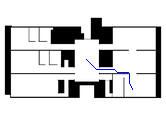

# A-star-algorithm

## Project Description
A* graph search algorithm is widely used in robotics for finding a collision-free path. Your task of this
evaluation project is to implement A* using C++.

## Objective
Implement a clean, production-grade A* path planner in modern C++, demonstrate it on 2D occupancy
maps

## Dependencies
- Ubuntu 22.04
- CMake
- C++20
- [Magick](https://imagemagick.org/script/magick++.php): Image-processing library
- [Eigen](https://eigen.tuxfamily.org/index.php?title=Main_Page): C++ template library for linear algebra: matrices, vertors, and related algorithms
- [GoogleTest](https://github.com/google/googletest): Testing framework for C++

## Build and Install
1. At the project root, create `build` folder
```
mkdir build
```
2. Initialize `CMake` configs
```
cmake -S . -B build -DCMAKE_INSTALL_PREFIX={/absolute_path/to/your/project_root}
```
3. Build and install
```
cmake --build build --parallel
cmake --install build --verbose
```

You can see `bin`, `include`, `lib` after installation.

## Test
```
cd {project_root}/build
```
Show details only failed test
```
ctest --output-on-failure
```
Show all details
```
ctest --verbose
```

## Run program
Before running program, check `--help` flag for information about input arguments.

**Example Run**

At project root
```
./bin/astar_search test9.png test9_resize.png -s 220 265 -g 510 346 --scaling_factor 2 --apply_scaling true
```

- `test9.png`, a file name of the original image, is required for the algorithm to process on.
- `test9_resize.png`, a file name to be written with the shortest path, is required for the program. Note that this name can be the same as the original image, if scaling is not applied.
- `-s 220 265` is a start (x,y) position in pixel (required).
- `-g 510 346` is a goal (x,y) position in pixel (required).
- `--scaling_factor 2` is one cell represents NxN pixels. In this case, it's 2x2 pixel/cell. Note that the default is 1 (1x1 pixel/cell).
- `--apply_scaling` is a flag whether the `scaling_factor` is applied.

## Output
All images including input images and output images are inside `images` folder. This program will **load/save any images** required from this folder.
In this **example**, the output image is named `output.png` by default.




Below is the detailed information about input arguments of this program.

**Input arguments**
```
Usage: astar_search [--help] [--version] --start_position VAR... --goal_position VAR... [--scaling_factor VAR] [--apply_scaling VAR] [--output_map VAR] map_to_process map_to_draw

Positional arguments:
  map_to_process        map image name to process occupancy grid (e.g. test1.png) 
  map_to_draw           map image name to draw the path on (e.g. test1.png). If scaling is applied, use resized map 

Optional arguments:
  -h, --help            shows help message and exits 
  -v, --version         prints version information and exits 
  -s, --start_position  start position in the map (e.g. 10 10) [nargs: 2] [required]
  -g, --goal_position   goal position in the map (e.g. 20 20) [nargs: 2] [required]
  --scaling_factor      map scaling factor. Default is 1 [nargs=0..1] [default: 1]
  --apply_scaling       whether to use scaling factor or not [nargs=0..1] [default: false]
  --output_map          Output map name with shortest path [nargs=0..1] [default: "output.png"]
```

## Issues
1. The A* algorithm in this project processes only on pixel images. To make this useful in navigation task and real world, we need to convert pixel to real x and y position (m), using resolution (m/cell) and map origin (x,y,theta).

2. Grid map algorithm loads images with (1/8/16) bit-per-channel. It cannot read any images out of these options. Additionally, all tested images are formatted as RGB.

3. The algorithm does not do obstacle inflation. Therefore, a searched path is very close to obstacle, especially in narrow corridors. 

## Trade-offs between Resolution, Speed, and Path Accuracy
This project take into account the cell decomposition (grid scaling) for search optimization. Let's consider below pictures. The first image is the original image with resolution 1 (1x1 pixel per cell).


The next image has resolution 2 (2x2 pixel per cell)


It's clear that, with resolution 2, the image is smaller so that it is much less computational expensive. 

This is confirmed by speed it takes. The original image takes 24 seconds to search, while the down-sampled image takes nearly 3 seconds (8 times lower!).


## Validation
For validation, other maps rather than this one are tested. A* search gives us deterministic path, producing accurate and identical path results.
Additionally, this project confirms the correctness of grid scaling as seen in the below pictures. 


**scaled by 2**


**scaled by 3**


**scaled by 4**


Multiple test cases are run successfully confirms the robustness of code.

